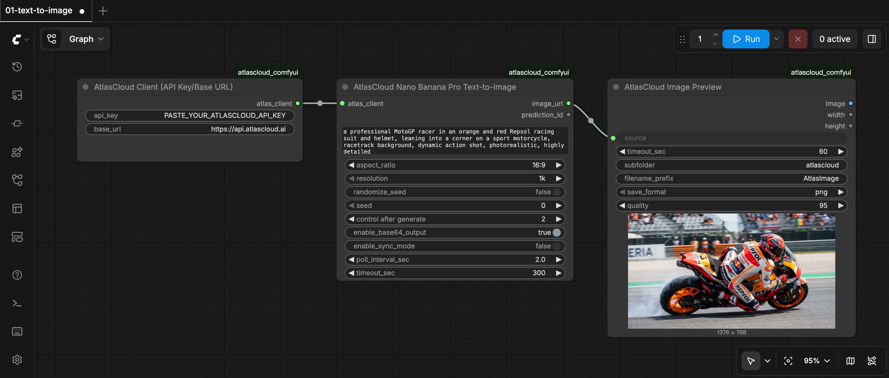

# atlascloud_comfyui

> Use Atlas Cloud's 300+ AI models inside ComfyUI. Drop-in nodes for Sora 2, Veo 3.1, Kling 3, Seedance 2, Nano Banana Pro, GPT Image 2, Flux 2, and more.

<p>
  <a href="https://github.com/AtlasCloudAI/atlascloud_comfyui/blob/main/LICENSE"></a>
  <a href="https://github.com/AtlasCloudAI/atlascloud_comfyui/stargazers"></a>
  <a href="https://github.com/AtlasCloudAI/atlascloud_comfyui/pulls"></a>
  
</p>

> **[→ Get your free Atlas Cloud API key](https://www.atlascloud.ai/console/api-keys?utm_source=github&utm_campaign=atlascloud_comfyui)** — one key, 300+ models, no local GPU or model weights needed.

<p align="center">
  
  <br />
  <sub><a href="examples/01-text-to-image.json"><code>examples/01-text-to-image.json</code></a> — paste your key into <b>AtlasCloud Client</b>, hit <b>Run</b>. Three nodes, no local GPU.</sub>
</p>

## Supported Models

- 🎬 **Video** — Seedance 2.0 · Kling 3 · Sora 2 · Veo 3.1 · HappyHorse 1 · Grok Imagine 1.5 · Wan 2.7
- 🎨 **Image** — Nano Banana 2/Pro · GPT Image 2/2.5 · Flux 2 · Seedream 5
- 💬 **LLM** — Claude · GPT · DeepSeek · MiniMax · Kimi · GLM · Qwen
- 🧊 **3D** — Seed3D 2.0 · Hunyuan3D Rapid/Pro · Tripo H3.1
- 🔊 **Audio** — Grok TTS
- 📚 **Explore more** — [300+ models »](https://www.atlascloud.ai/models?utm_source=github&utm_campaign=atlascloud_comfyui)

This node pack focuses on **image / video / edit** — see the full **[node catalog by task type](#available-nodes)** below.

## Contents

- [Supported Models](#supported-models)
- [Quickstart](#quickstart-5-minutes)
- [Requirements](#requirements)
- [Installation](#installation)
- [Available Nodes](#available-nodes)
- [Example Workflows](#example-workflows)
- [Troubleshooting](#troubleshooting)
- [More Atlas Cloud Tools](#more-atlas-cloud-tools)
- [License](#license)

## Quickstart (5 minutes)

1. Install the nodes (see [Installation](#installation)).
2. Drag [`examples/01-text-to-image.json`](examples/01-text-to-image.json) onto the ComfyUI canvas.
3. Open the **AtlasCloud Client** node and paste your [API key](https://www.atlascloud.ai/console/api-keys?utm_source=github&utm_campaign=atlascloud_comfyui).
4. Hit **Run** — your first image renders through Atlas Cloud. More graphs in [`examples/`](examples/).

---

## Requirements

-   **ComfyUI** (Desktop app or source install)

-   Python dependencies are handled by ComfyUI’s own environment (recommended)

-   An **Atlas Cloud API Key** — [get one free](https://www.atlascloud.ai/console/api-keys?utm_source=github&utm_campaign=atlascloud_comfyui)

> Tip: If you’re using **ComfyUI Desktop**, you should install dependencies into ComfyUI’s bundled venv (not your system Python).

---

## Installation

### Option A — ComfyUI Desktop (Recommended)

1. Quit ComfyUI Desktop completely.
2. Open a terminal and go to your ComfyUI custom nodes folder:

    ```bash
    cd ~/Documents/ComfyUI/custom_nodes
    ```

3. Clone the repo:
    ```
    git clone https://github.com/AtlasCloudAI/atlascloud_comfyui.git
    ```
4. Install dependencies into ComfyUI Desktop venv:

    ```
    cd atlascloud_comfyui
    ~/Documents/ComfyUI/.venv/bin/python -m pip install -r requirements.txt
    ```

5. Launch ComfyUI Desktop again. You should see Atlas Cloud nodes under:
   **Node Library → AtlasCloud**

### Option B — ComfyUI Source Installation (Recommended)

1. Go to your ComfyUI `custom_nodes` directory:
   `cd /path/to/ComfyUI/custom_nodes`

2. Clone the repo:
   `git clone https://github.com/AtlasCloudAI/atlascloud_comfyui.git`
3. Install dependencies using the same Python environment you use to run ComfyUI:
    ```
    cd atlascloud_comfyui
    python -m pip install -r requirements.txt
    ```
4. Restart ComfyUI.

---

## Available Nodes

> Note: Some nodes are kept for **backward compatibility** even if their model id is no longer returned by Atlas Cloud `/api/v1/models`. These nodes are marked as **Deprecated** and will raise an error at runtime unless you set `ATLAS_ALLOW_DEPRECATED_MODELS=1`.

### Common

-   **AtlasCloud Client** — Stores your API key and base URL for all Atlas Cloud nodes.
-   **Image Previewer** — Preview generated images in ComfyUI.
-   **Video Previewer** — Preview generated videos in ComfyUI.
-   **AtlasCloud Download 3D Model** — Download a generated mesh into `output/` for **Preview 3D** / **Load 3D**.

### Text-to-Video (T2V)

| Node | Model |
|------|-------|
| AtlasCloud VEO3 Text-to-Video | google/veo3 |
| AtlasCloud VEO3 Fast Text-to-Video | google/veo3-fast |
| AtlasCloud VEO3.1 Text-to-Video | google/veo3.1/text-to-video |
| AtlasCloud VEO3.1 Lite Text-to-Video | google/veo3.1-lite/text-to-video |
| AtlasCloud VEO3.1 Fast Text-to-Video | google/veo3.1-fast/text-to-video |
| AtlasCloud Gemini Omni Flash Text-to-Video Developer | google/gemini-omni-flash/text-to-video-developer |
| AtlasCloud Gemini Omni Flash Text-to-Video | google/gemini-omni-flash/text-to-video |
| AtlasCloud Gemini Omni Flash Image-to-Video | google/gemini-omni-flash/image-to-video |
| AtlasCloud Cosmos 3 Super Image-to-Video | nvidia/cosmos-3-super/image-to-video |
| AtlasCloud Gemini Omni Flash Reference-to-Video | google/gemini-omni-flash/reference-to-video |
| AtlasCloud Gemini Omni Flash Video Edit | google/gemini-omni-flash/video-edit |
| AtlasCloud Gemini Omni 1.1 Flash Text-to-Video | google/gemini-omni-1.1-flash/text-to-video |
| AtlasCloud Gemini Omni 1.1 Flash Image-to-Video | google/gemini-omni-1.1-flash/image-to-video |
| AtlasCloud Gemini Omni 1.1 Flash Reference-to-Video | google/gemini-omni-1.1-flash/reference-to-video |
| AtlasCloud Gemini Omni 1.1 Flash Video Edit | google/gemini-omni-1.1-flash/video-edit |
| AtlasCloud Gemini Omni 1.1 Flash Video Extend | google/gemini-omni-1.1-flash/video-extend |
| AtlasCloud Grok Imagine Video Text-to-Video | xai/grok-imagine-video/text-to-video |
| AtlasCloud VEO2 Text-to-Video | google/veo2 |
| AtlasCloud WAN2.6 Text-to-Video | alibaba/wan-2.6/text-to-video |
| AtlasCloud WAN2.7 Text-to-Video | alibaba/wan-2.7/text-to-video |
| AtlasCloud HappyHorse 1.0 Text-to-Video | alibaba/happyhorse-1.0/text-to-video |
| AtlasCloud HappyHorse 1.1 Text-to-Video | alibaba/happyhorse-1.1/text-to-video |
| AtlasCloud WAN2.6 Video-to-Video | alibaba/wan-2.6/video-to-video |
| AtlasCloud Kling Video O3 Pro Text-to-Video | kwaivgi/kling-video-o3-pro/text-to-video |
| AtlasCloud Kling Video O3 Std Text-to-Video | kwaivgi/kling-video-o3-std/text-to-video |
| AtlasCloud WAN2.5 Text-to-Video | alibaba/wan-2.5/text-to-video |
| AtlasCloud WAN2.5 Text-to-Video Fast | alibaba/wan-2.5/text-to-video-fast |
| AtlasCloud Van-2.6 Text-to-Video | atlascloud/van-2.6/text-to-video |
| AtlasCloud Seedance V1 Pro Fast Text-to-Video | bytedance/seedance-v1-pro-fast/text-to-video |
| AtlasCloud Kling V2.1 T2V Master | kwaivgi/kling-v2.1-t2v-master |
| AtlasCloud Kling V2.0 T2V Master | kwaivgi/kling-v2.0-t2v-master |
| AtlasCloud WAN2.2 Text-to-Video 720p | alibaba/wan-2.2/text-to-video-720p |
| AtlasCloud WAN2.2 Text-to-Video 480p | alibaba/wan-2.2/t2v-480p |
| AtlasCloud Luma Ray 2 Text-to-Video | luma/ray-2-t2v |
| AtlasCloud Luma Ray 2 Flash Text-to-Video | luma/ray-2-flash-t2v |
| AtlasCloud Pika V2.2 Text-to-Video | pika/v2.2-t2v |
| AtlasCloud Pika V2.0 Turbo Text-to-Video | pika/v2.0-turbo-t2v |
| AtlasCloud PixVerse V4.5 Text-to-Video | pixverse/pixverse-v4.5-t2v |
| AtlasCloud PixVerse C1 Text-to-Video | pixverse/c1/text-to-video |
| AtlasCloud PixVerse C1 Image-to-Video | pixverse/c1/image-to-video |
| AtlasCloud PixVerse C1 Reference-to-Video | pixverse/c1/reference-to-video |
| AtlasCloud PixVerse V6 Text-to-Video | pixverse/v6/text-to-video |
| AtlasCloud PixVerse V6 Image-to-Video | pixverse/v6/image-to-video |
| AtlasCloud PixVerse V6 Reference-to-Video | pixverse/v6/reference-to-video |
| AtlasCloud PixVerse V6 Video-Extend | pixverse/v6/video-extend |
| AtlasCloud PixVerse C1 Start-End-to-Video | pixverse/c1/start-end-to-video |
| AtlasCloud PixVerse V6 Start-End-to-Video | pixverse/v6/start-end-to-video |
| AtlasCloud Hailuo 02 T2V Pro | minimax/hailuo-02/t2v-pro |
| AtlasCloud Hailuo 02 T2V Standard | minimax/hailuo-02/t2v-standard |
| AtlasCloud Hailuo 02 Pro | minimax/hailuo-02/pro |
| AtlasCloud Hailuo 02 Fast | minimax/hailuo-02/fast |
| AtlasCloud Hailuo 2.3 Pro Text-to-Video | minimax/hailuo-2.3-pro/text-to-video |
| AtlasCloud Hailuo 2.3 T2V Standard | minimax/hailuo-2.3/t2v-standard |
| AtlasCloud Sora 2 Text-to-Video | openai/sora-2/text-to-video |
| AtlasCloud Sora 2 Text-to-Video Pro | openai/sora-2/text-to-video-pro |
| AtlasCloud Kling V3.0 Pro Text-to-Video | kwaivgi/kling-v3.0-pro/text-to-video |
| AtlasCloud Kling V3.0 4K Text-to-Video | kwaivgi/kling-v3.0-4k/text-to-video |
| AtlasCloud Kling V3.0 4K Image-to-Video | kwaivgi/kling-v3.0-4k/image-to-video |
| AtlasCloud Kling V3.0 Turbo Text-to-Video | kwaivgi/kling-v3.0-turbo/text-to-video |
| AtlasCloud Kling V3.0 Turbo Image-to-Video | kwaivgi/kling-v3.0-turbo/image-to-video |
| AtlasCloud Kling Video O3 4K Text-to-Video | kwaivgi/kling-video-o3-4k/text-to-video |
| AtlasCloud Kling Video O3 4K Image-to-Video | kwaivgi/kling-video-o3-4k/image-to-video |
| AtlasCloud Kling V3.0 Std Text-to-Video | kwaivgi/kling-v3.0-std/text-to-video |
| AtlasCloud Kling V2.6 Pro Text-to-Video | kwaivgi/kling-v2.6-pro/text-to-video |
| AtlasCloud Kling V2.6 Pro Avatar | kwaivgi/kling-v2.6-pro/avatar |
| AtlasCloud Kling V2.6 Std Avatar | kwaivgi/kling-v2.6-std/avatar |
| AtlasCloud Kling V2.6 Pro Motion-Control | kwaivgi/kling-v2.6-pro/motion-control |
| AtlasCloud Kling V2.6 Std Motion-Control | kwaivgi/kling-v2.6-std/motion-control |
| AtlasCloud Kling V2.5 Turbo Pro Text-to-Video | kwaivgi/kling-v2.5-turbo-pro/text-to-video |
| AtlasCloud Kling Video O1 Text-to-Video | kwaivgi/kling-video-o1/text-to-video |
| AtlasCloud Seedance V1 Pro Text-to-Video 1080p | bytedance/seedance-v1-pro/text-to-video-1080p |
| AtlasCloud Seedance V1 Pro Text-to-Video 720p | bytedance/seedance-v1-pro-t2v-720p |
| AtlasCloud Seedance V1 Pro Text-to-Video 480p | bytedance/seedance-v1-pro-t2v-480p |
| AtlasCloud Seedance V1 Lite Text-to-Video 480p | bytedance/seedance-v1-lite-t2v-480p |
| AtlasCloud Seedance V1 Lite T2V 1080p | bytedance/seedance-v1-lite-t2v-1080p |
| AtlasCloud Seedance V1 Lite T2V 720p | bytedance/seedance-v1-lite-t2v-720p |
| AtlasCloud Seedance V1.5 Pro Text-to-Video | bytedance/seedance-v1.5-pro/text-to-video |
| AtlasCloud Seedance 2.0 Text-to-Video | bytedance/seedance-2.0/text-to-video |
| AtlasCloud Seedance 2.0 Fast Text-to-Video | bytedance/seedance-2.0-fast/text-to-video |
| AtlasCloud Seedance 2.0 Text-to-Video Upscaled | bytedance/seedance-2.0/text-to-video-upscaled |
| AtlasCloud Seedance 2.0 Fast Text-to-Video Upscaled | bytedance/seedance-2.0-fast/text-to-video-upscaled |
| AtlasCloud Seedance V1.5 Pro Text-to-Video Fast | bytedance/seedance-v1.5-pro/text-to-video-fast |
| AtlasCloud Vidu Q1 Text-to-Video | vidu/q1/text-to-video |
| AtlasCloud Vidu Q2 Text-to-Video | vidu/q2/text-to-video |
| AtlasCloud Hunyuan Text-to-Video | atlascloud/hunyuan-video/t2v |

### Image-to-Video (I2V)

| Node | Model |
|------|-------|
| AtlasCloud VEO3 Image-to-Video | google/veo3/image-to-video |
| AtlasCloud VEO3 Fast Image-to-Video | google/veo3-fast/image-to-video |
| AtlasCloud Midjourney V8.1 Image-to-Video | midjourney/v8.1/image-to-video |
| AtlasCloud Youchuan V8.1 Image-to-Video | youchuan/v8.1/image-to-video |
| AtlasCloud Youchuan V8.2 Image-to-Video | youchuan/v8.2/image-to-video |
| AtlasCloud VEO3.1 Fast Image-to-Video | google/veo3.1-fast/image-to-video |
| AtlasCloud Gemini Omni Flash Image-to-Video Developer | google/gemini-omni-flash/image-to-video-developer |
| AtlasCloud Gemini Omni Flash Reference-to-Video Developer | google/gemini-omni-flash/reference-to-video-developer |
| AtlasCloud Grok Imagine Video Image-to-Video | xai/grok-imagine-video/image-to-video |
| AtlasCloud Grok Imagine Video v1.5 Image-to-Video | xai/grok-imagine-video-v1.5/image-to-video |
| AtlasCloud Grok Imagine Video Reference-to-Video | xai/grok-imagine-video/reference-to-video |
| AtlasCloud Grok Imagine Video v1.5 Text-to-Video | xai/grok-imagine-video-v1.5/text-to-video |
| AtlasCloud Grok Imagine Video v1.5 Reference-to-Video | xai/grok-imagine-video-v1.5/reference-to-video |
| AtlasCloud Grok Imagine Video v1.5 Developer Text-to-Video | xai/grok-imagine-video-v1.5-developer/text-to-video |
| AtlasCloud Grok Imagine Video v1.5 Developer Image-to-Video | xai/grok-imagine-video-v1.5-developer/image-to-video |
| AtlasCloud Grok Imagine Video v1.5 Developer Reference-to-Video | xai/grok-imagine-video-v1.5-developer/reference-to-video |
| AtlasCloud Grok Imagine Video Edit | xai/grok-imagine-video/edit-video |
| AtlasCloud Grok Imagine Video Extend | xai/grok-imagine-video/extend-video |
| AtlasCloud VEO3.1 Reference-to-Video | google/veo3.1/reference-to-video |
| AtlasCloud Seedance 2.0 Reference-to-Video | bytedance/seedance-2.0/reference-to-video |
| AtlasCloud Seedance 2.0 Fast Reference-to-Video | bytedance/seedance-2.0-fast/reference-to-video |
| AtlasCloud Seedance 2.0 Mini Text-to-Video | bytedance/seedance-2.0-mini/text-to-video |
| AtlasCloud Seedance 2.0 Mini Image-to-Video | bytedance/seedance-2.0-mini/image-to-video |
| AtlasCloud Seedance 2.0 Mini Reference-to-Video | bytedance/seedance-2.0-mini/reference-to-video |
| AtlasCloud Seedance 2.5 Text-to-Video | bytedance/seedance-2.5/text-to-video |
| AtlasCloud Seedance 2.5 Image-to-Video | bytedance/seedance-2.5/image-to-video |
| AtlasCloud Seedance 2.5 Reference-to-Video | bytedance/seedance-2.5/reference-to-video |
| AtlasCloud Avatar Omni Human 1.5 | bytedance/avatar-omni-human-v1.5 |
| AtlasCloud Image Upscaler | atlascloud/image-upscaler |
| AtlasCloud Face Swap (Image) | atlascloud/face-swap-image |
| AtlasCloud Photo Cleanup | atlascloud/photo-cleanup |
| AtlasCloud Face Swap (Video) | atlascloud/face-swap-video |
| AtlasCloud Seedance 2.0 Reference-to-Video Upscaled | bytedance/seedance-2.0/reference-to-video-upscaled |
| AtlasCloud Seedance 2.0 Fast Reference-to-Video Upscaled | bytedance/seedance-2.0-fast/reference-to-video-upscaled |
| AtlasCloud Vidu Q3 Reference-to-Video | vidu/q3/reference-to-video |
| AtlasCloud Vidu Q3-Mix Reference-to-Video | vidu/q3-mix/reference-to-video |
| AtlasCloud VEO3.1 Image-to-Video | google/veo3.1/image-to-video |
| AtlasCloud VEO3.1 Lite Image-to-Video | google/veo3.1-lite/image-to-video |
| AtlasCloud VEO3.1 Lite Start-End Frame-to-Video | google/veo3.1-lite/start-end-frame-to-video |
| AtlasCloud VEO2 Image-to-Video | google/veo2/image-to-video |
| AtlasCloud WAN2.5 Image-to-Video | alibaba/wan-2.5/image-to-video |
| AtlasCloud WAN2.5 Image-to-Video Fast | alibaba/wan-2.5/image-to-video-fast |
| AtlasCloud Van-2.5 Text-to-Video | atlascloud/van-2.5/text-to-video |
| AtlasCloud Van-2.5 Image-to-Video | atlascloud/van-2.5/image-to-video |
| AtlasCloud Kling V2.1 I2V Standard | kwaivgi/kling-v2.1-i2v-standard |
| AtlasCloud WAN2.2 Animate Mix | alibaba/wan-2.2/animate-mix |
| AtlasCloud WAN2.2 Animate Move | alibaba/wan-2.2/animate-move |
| AtlasCloud Veed Fabric 1.0 Image-to-Video | veed/fabric-1.0/image-to-video |
| AtlasCloud Veed Fabric 1.0 Fast Image-to-Video | veed/fabric-1.0/fast/image-to-video |
| AtlasCloud Video Upscaler (Video-to-Video) | atlascloud/video-upscaler |
| AtlasCloud WAN2.2 Image-to-Video 720p | alibaba/wan-2.2/i2v-720p |
| AtlasCloud WAN2.2 Image-to-Video 480p | alibaba/wan-2.2/i2v-480p |
| AtlasCloud Wan 2.2 Turbo Infinite Image-to-Video | atlascloud/wan-2.2-turbo/infinite-image-to-video |
| AtlasCloud Wan 2.2 Turbo Infinite Image-to-Video LoRA | atlascloud/wan-2.2-turbo/infinite-image-to-video-lora |
| AtlasCloud Wan 2.2 Turbo Spicy Infinite Image-to-Video | atlascloud/wan-2.2-turbo-spicy/infinite-image-to-video |
| AtlasCloud Wan 2.2 Turbo Spicy Infinite Image-to-Video LoRA | atlascloud/wan-2.2-turbo-spicy/infinite-image-to-video-lora |
| AtlasCloud Van-2.6 Image-to-Video | atlascloud/van-2.6/image-to-video |
| AtlasCloud Seedance V1 Pro Fast Image-to-Video | bytedance/seedance-v1-pro-fast/image-to-video |
| AtlasCloud Seedance V1 Pro I2V 1080p | bytedance/seedance-v1-pro-i2v-1080p |
| AtlasCloud Seedance V1 Pro I2V 720p | bytedance/seedance-v1-pro-i2v-720p |
| AtlasCloud Seedance V1 Pro I2V 480p | bytedance/seedance-v1-pro-i2v-480p |
| AtlasCloud Vidu Reference-to-Video Q1 | vidu/reference-to-video-q1 |
| AtlasCloud Vidu Reference-to-Video 2.0 | vidu/reference-to-video-2.0 |
| AtlasCloud Vidu Q2-Pro-Fast Reference-to-Video | vidu/q2-pro-fast/reference-to-video |
| AtlasCloud Vidu Q2-Pro-Fast Reference-to-Video (with Audio) | vidu/q2-pro-fast/reference-to-video-with-audio |
| AtlasCloud Vidu Q1 Image-to-Video | vidu/q1/image-to-video |
| AtlasCloud Vidu Q1 Start-End-to-Video | vidu/q1/start-end-to-video |
| AtlasCloud Vidu Q1 Reference-to-Video | vidu/q1/reference-to-video |
| AtlasCloud Vidu Q2 Reference-to-Video | vidu/q2/reference-to-video |
| AtlasCloud Vidu Q2-Pro Image-to-Video | vidu/q2-pro/image-to-video |
| AtlasCloud Vidu Q2-Pro Start-End-to-Video | vidu/q2-pro/start-end-to-video |
| AtlasCloud Vidu Q2-Pro Reference-to-Video | vidu/q2-pro/reference-to-video |
| AtlasCloud Vidu Q2-Pro-Fast Image-to-Video | vidu/q2-pro-fast/image-to-video |
| AtlasCloud Vidu Q2-Pro-Fast Start-End-to-Video | vidu/q2-pro-fast/start-end-to-video |
| AtlasCloud Vidu Q2-Turbo Image-to-Video | vidu/q2-turbo/image-to-video |
| AtlasCloud Vidu Q2-Turbo Start-End-to-Video | vidu/q2-turbo/start-end-to-video |
| AtlasCloud Vidu Start-End-to-Video 2.0 | vidu/start-end-to-video-2.0 |
| AtlasCloud Kling V2.0 I2V Master | kwaivgi/kling-v2.0-i2v-master |
| AtlasCloud Kling V2.1 I2V Master | kwaivgi/kling-v2.1-i2v-master |
| AtlasCloud Kling V2.1 I2V Pro (Start/End Frame) | kwaivgi/kling-v2.1-i2v-pro/start-end-frame |
| AtlasCloud Kling V2.1 I2V Pro | kwaivgi/kling-v2.1-i2v-pro |
| AtlasCloud Kling V1.6 Multi I2V Pro | kwaivgi/kling-v1.6-multi-i2v-pro |
| AtlasCloud Kling V1.6 Multi I2V Standard | kwaivgi/kling-v1.6-multi-i2v-standard |
| AtlasCloud Kling V1.6 I2V Pro | kwaivgi/kling-v1.6-i2v-pro |
| AtlasCloud Kling V1.6 I2V Standard | kwaivgi/kling-v1.6-i2v-standard |
| AtlasCloud Kling Effects | kwaivgi/kling-effects |
| AtlasCloud WAN2.6 Image-to-Video | alibaba/wan-2.6/image-to-video |
| AtlasCloud WAN2.6 Spicy Image-to-Video | atlascloud/wan-2.6-spicy/image-to-video |
| AtlasCloud WAN2.7 Spicy Image-to-Video | atlascloud/wan-2.7-spicy/image-to-video |
| AtlasCloud WAN2.7 Spicy Reference-to-Video | atlascloud/wan-2.7-spicy/reference-to-video |
| AtlasCloud MiniMax H3 Text-to-Video | minimax/h3/text-to-video |
| AtlasCloud MiniMax H3 Image-to-Video | minimax/h3/image-to-video |
| AtlasCloud MiniMax H3 Reference-to-Video | minimax/h3/reference-to-video |
| AtlasCloud MiniMax H3-Developer Text-to-Video | minimax/h3-developer/text-to-video |
| AtlasCloud MiniMax H3-Developer Image-to-Video | minimax/h3-developer/image-to-video |
| AtlasCloud MiniMax H3-Developer Reference-to-Video | minimax/h3-developer/reference-to-video |
| AtlasCloud MiniMax H3 Max Text-to-Video | minimax/h3-max/text-to-video |
| AtlasCloud MiniMax H3 Max Image-to-Video | minimax/h3-max/image-to-video |
| AtlasCloud MiniMax H3 Max Turbo Text-to-Video | minimax/h3-max-turbo/text-to-video |
| AtlasCloud MiniMax H3 Max Turbo Image-to-Video | minimax/h3-max-turbo/image-to-video |
| AtlasCloud MiniMax H3 Fast Text-to-Video | minimax/h3-fast/text-to-video |
| AtlasCloud MiniMax H3 Fast Image-to-Video | minimax/h3-fast/image-to-video |
| AtlasCloud MiniMax H3 Fast Reference-to-Video | minimax/h3-fast/reference-to-video |
| AtlasCloud Tencent Image Upscaler | tencent/image/upscaler |
| AtlasCloud Tencent Video Upscaler | tencent/video/upscaler |
| AtlasCloud BytePlus Video Upscaler | byteplus/video/upscaler |
| AtlasCloud WAN2.7 Image-to-Video | alibaba/wan-2.7/image-to-video |
| AtlasCloud HappyHorse 1.0 Image-to-Video | alibaba/happyhorse-1.0/image-to-video |
| AtlasCloud HappyHorse 1.1 Image-to-Video | alibaba/happyhorse-1.1/image-to-video |
| AtlasCloud HappyHorse 1.0 Reference-to-Video | alibaba/happyhorse-1.0/reference-to-video |
| AtlasCloud HappyHorse 1.1 Reference-to-Video | alibaba/happyhorse-1.1/reference-to-video |
| AtlasCloud WAN2.7 Reference-to-Video | alibaba/wan-2.7/reference-to-video |
| AtlasCloud WAN3.0 Text-to-Video | alibaba/wan-3.0/text-to-video |
| AtlasCloud WAN3.0 Image-to-Video | alibaba/wan-3.0/image-to-video |
| AtlasCloud WAN3.0 Reference-to-Video | alibaba/wan-3.0/reference-to-video |
| AtlasCloud WAN3.0-Prime Text-to-Video | alibaba/wan-3.0-prime/text-to-video |
| AtlasCloud WAN3.0-Prime Image-to-Video | alibaba/wan-3.0-prime/image-to-video |
| AtlasCloud WAN3.0-Prime Reference-to-Video | alibaba/wan-3.0-prime/reference-to-video |
| AtlasCloud Studio Food Motion | atlascloud/studio/food-motion |
| AtlasCloud Studio Virtual Try-On | atlascloud/studio/virtual-try-on |
| AtlasCloud Studio UGC Ad | atlascloud/studio/ugc-ad |
| AtlasCloud Studio Trend Remix | atlascloud/studio/trend-remix |
| AtlasCloud Studio TVC Maker | atlascloud/studio/tvc-maker |
| AtlasCloud WAN2.6 Image-to-Video Flash | alibaba/wan-2.6/image-to-video-flash |
| AtlasCloud Kling Video O3 Pro Image-to-Video | kwaivgi/kling-video-o3-pro/image-to-video |
| AtlasCloud Kling Video O3 Std Image-to-Video | kwaivgi/kling-video-o3-std/image-to-video |
| AtlasCloud Kling Video O3 Pro Reference-to-Video | kwaivgi/kling-video-o3-pro/reference-to-video |
| AtlasCloud Kling Video O3 Std Reference-to-Video | kwaivgi/kling-video-o3-std/reference-to-video |
| AtlasCloud Luma Ray 2 Image-to-Video | luma/ray-2-i2v |
| AtlasCloud Pika V2.1 Image-to-Video | pika/v2.1-i2v |
| AtlasCloud PixVerse V4.5 Image-to-Video | pixverse/pixverse-v4.5-i2v |
| AtlasCloud Hailuo 02 I2V Pro | minimax/hailuo-02/i2v-pro |
| AtlasCloud Hailuo 02 I2V Standard | minimax/hailuo-02/i2v-standard |
| AtlasCloud Hailuo 02 Standard | minimax/hailuo-02/standard |
| AtlasCloud Hailuo 2.3 I2V Standard | minimax/hailuo-2.3/i2v-standard |
| AtlasCloud Hailuo 2.3 I2V Pro | minimax/hailuo-2.3/i2v-pro |
| AtlasCloud Hailuo 2.3 Fast | minimax/hailuo-2.3/fast |
| AtlasCloud Sora 2 Image-to-Video | openai/sora-2/image-to-video |
| AtlasCloud Sora 2 Image-to-Video Pro | openai/sora-2/image-to-video-pro |
| AtlasCloud Kling V3.0 Pro Image-to-Video | kwaivgi/kling-v3.0-pro/image-to-video |
| AtlasCloud Kling V3.0 Std Image-to-Video | kwaivgi/kling-v3.0-std/image-to-video |
| AtlasCloud Kling V2.6 Pro Image-to-Video | kwaivgi/kling-v2.6-pro/image-to-video |
| AtlasCloud Kling Video O1 Image-to-Video | kwaivgi/kling-video-o1/image-to-video |
| AtlasCloud Seedance V1.5 Pro Image-to-Video | bytedance/seedance-v1.5-pro/image-to-video |
| AtlasCloud Seedance 2.0 Image-to-Video | bytedance/seedance-2.0/image-to-video |
| AtlasCloud Seedance 2.0 Fast Image-to-Video | bytedance/seedance-2.0-fast/image-to-video |
| AtlasCloud Seedance 2.0 Image-to-Video Upscaled | bytedance/seedance-2.0/image-to-video-upscaled |
| AtlasCloud Seedance 2.0 Fast Image-to-Video Upscaled | bytedance/seedance-2.0-fast/image-to-video-upscaled |
| AtlasCloud Seedance V1.5 Pro Image-to-Video (Spicy) | bytedance/seedance-v1.5-pro/image-to-video-spicy |
| AtlasCloud Seedance V1 Lite I2V 1080p | bytedance/seedance-v1-lite-i2v-1080p |
| AtlasCloud Seedance V1 Lite I2V 720p | bytedance/seedance-v1-lite-i2v-720p |
| AtlasCloud Seedance V1 Lite I2V 480p | bytedance/seedance-v1-lite-i2v-480p |
| AtlasCloud Seedance V1.5 Pro Image-to-Video Fast | bytedance/seedance-v1.5-pro/image-to-video-fast |
| AtlasCloud Kling V2.5 Turbo Pro Image-to-Video | kwaivgi/kling-v2.5-turbo-pro/image-to-video |
| AtlasCloud Vidu Q3 Text-to-Video | vidu/q3/text-to-video |
| AtlasCloud Vidu Q3-Pro Text-to-Video | vidu/q3-pro/text-to-video |
| AtlasCloud Vidu Q3 Image-to-Video | vidu/image-to-video-2.0 |
| AtlasCloud Vidu Q3 Image-to-Video (Q3 API) | vidu/q3/image-to-video |
| AtlasCloud Vidu Q3-Pro Image-to-Video | vidu/q3-pro/image-to-video |
| AtlasCloud Vidu Q3-Pro Start-End-to-Video | vidu/q3-pro/start-end-to-video |
| AtlasCloud Vidu Q3-Turbo Text-to-Video | vidu/q3-turbo/text-to-video |
| AtlasCloud Vidu Q3-Turbo Image-to-Video | vidu/q3-turbo/image-to-video |
| AtlasCloud Vidu Q3-Turbo Start-End-to-Video | vidu/q3-turbo/start-end-to-video |
| AtlasCloud WAN2.2 Spicy Image-to-Video | alibaba/wan-2.2-spicy/image-to-video |
| AtlasCloud WAN2.2 Turbo Image-to-Video | atlascloud/wan-2.2-turbo/image-to-video |
| AtlasCloud WAN2.2 Turbo Spicy Image-to-Video | atlascloud/wan-2.2-turbo-spicy/image-to-video |
| AtlasCloud WAN2.2 Turbo Spicy Image-to-Video LoRA | atlascloud/wan-2.2-turbo-spicy/image-to-video-lora |
| AtlasCloud WAN2.2 Spicy Image-to-Video LoRA | alibaba/wan-2.2-spicy/image-to-video-lora |
| AtlasCloud Hunyuan Image-to-Video | atlascloud/hunyuan-video/i2v |
| AtlasCloud WAN2.2 (AtlasCloud) Image-to-Video | atlascloud/wan-2.2/image-to-video |
| AtlasCloud WAN2.2 (AtlasCloud) Image-to-Video LoRA | atlascloud/wan-2.2/image-to-video-lora |

### Audio-to-Video (A2V)

| Node | Model |
|------|-------|
| AtlasCloud InfiniteTalk Audio-to-Video | atlascloud/infinitetalk |
| AtlasCloud Sync Lipsync v3 | sync/lipsync-v3 |
| AtlasCloud VEED Lipsync | veed/lipsync |

### Text-to-Image (T2I)

| Node | Model |
|------|-------|
| AtlasCloud Midjourney V8.1 Text-to-Image | midjourney/v8.1/text-to-image |
| AtlasCloud Midjourney V8.1 Image-to-Image | midjourney/v8.1/image-to-image |
| AtlasCloud Midjourney V8.1 Blend | midjourney/v8.1/blend |
| AtlasCloud Midjourney V8.1 Remove Background | midjourney/v8.1/remove-background |
| AtlasCloud Midjourney V8.1 Style Transfer | midjourney/v8.1/style-transfer |
| AtlasCloud Youchuan V8.1 Text-to-Image | youchuan/v8.1/text-to-image |
| AtlasCloud Youchuan V8.1 Image-to-Image | youchuan/v8.1/image-to-image |
| AtlasCloud Youchuan V8.1 Blend | youchuan/v8.1/blend |
| AtlasCloud Youchuan V8.1 Remove Background | youchuan/v8.1/remove-background |
| AtlasCloud Youchuan V8.1 Style Transfer | youchuan/v8.1/style-transfer |
| AtlasCloud Youchuan V8.2 Text-to-Image | youchuan/v8.2/text-to-image |
| AtlasCloud Youchuan V8.2 Image-to-Image | youchuan/v8.2/image-to-image |
| AtlasCloud Youchuan V8.2 Blend | youchuan/v8.2/blend |
| AtlasCloud Youchuan V8.2 Remove Background | youchuan/v8.2/remove-background |
| AtlasCloud Youchuan V8.2 Style Transfer | youchuan/v8.2/style-transfer |
| AtlasCloud WAN2.6 Text-to-Image | alibaba/wan-2.6/text-to-image |
| AtlasCloud WAN2.7 Text-to-Image | alibaba/wan-2.7/text-to-image |
| AtlasCloud WAN2.7 Pro Text-to-Image | alibaba/wan-2.7-pro/text-to-image |
| AtlasCloud WAN2.5 Text-to-Image | alibaba/wan-2.5/text-to-image |
| AtlasCloud Imagen4 Text-to-Image | google/imagen4 |
| AtlasCloud Imagen4 Fast Text-to-Image | google/imagen4-fast |
| AtlasCloud Imagen4 Ultra Text-to-Image | google/imagen4-ultra |
| AtlasCloud Imagen3 Text-to-Image | google/imagen3 |
| AtlasCloud Imagen3 Fast Text-to-Image | google/imagen3-fast |
| AtlasCloud Nano Banana 2 Text-to-Image | google/nano-banana-2/text-to-image |
| AtlasCloud Nano Banana 2 Text-to-Image Developer | google/nano-banana-2/text-to-image-developer |
| AtlasCloud Nano Banana 2 Lite Text-to-Image | google/nano-banana-2-lite/text-to-image |
| AtlasCloud Nano Banana 2 Lite Text-to-Image Developer | google/nano-banana-2-lite/text-to-image-developer |
| AtlasCloud HiDream O1 1.5 Text-to-Image | hidream-o1-1.5/text-to-image |
| AtlasCloud Nano Banana Pro Text-to-Image Ultra | google/nano-banana-pro/text-to-image-ultra |
| AtlasCloud Nano Banana Pro Text-to-Image | google/nano-banana-pro/text-to-image |
| AtlasCloud Nano Banana Pro Text-to-Image Developer | google/nano-banana-pro/text-to-image-developer |
| AtlasCloud Nano Banana Text-to-Image | google/nano-banana/text-to-image |
| AtlasCloud Nano Banana Text-to-Image Developer | google/nano-banana/text-to-image-developer |
| AtlasCloud Seedream V5.0 Lite Text-to-Image | bytedance/seedream-v5.0-lite |
| AtlasCloud Seedream V5.0 Lite Sequential Text-to-Image | bytedance/seedream-v5.0-lite/sequential |
| AtlasCloud Seedream V5.0 Pro Text-to-Image | bytedance/seedream-v5.0-pro/text-to-image |
| AtlasCloud Cosmos 3 Super Text-to-Image | nvidia/cosmos-3-super/text-to-image |
| AtlasCloud Seedream V4 Text-to-Image | bytedance/seedream-v4 |
| AtlasCloud Seedream V4 Sequential Text-to-Image | bytedance/seedream-v4/sequential |
| AtlasCloud Seedream V4.5 Text-to-Image | bytedance/seedream-v4.5 |
| AtlasCloud Seedream V4.5 Sequential Text-to-Image | bytedance/seedream-v4.5/sequential |
| AtlasCloud Seedream V4.7 Text-to-Image | bytedance/seedream-v4.7/text-to-image |
| AtlasCloud Seedream V4.7 Sequential Text-to-Image | bytedance/seedream-v4.7/sequential |
| AtlasCloud ZImage Turbo Text-to-Image | z-image/turbo |
| AtlasCloud Ideogram V3 Quality Text-to-Image | ideogram-ai/ideogram-v3-quality |
| AtlasCloud Ideogram V3 Turbo Text-to-Image | ideogram-ai/ideogram-v3-turbo |
| AtlasCloud Ideogram V4 Quality Text-to-Image | ideogram/v4/quality/text-to-image |
| AtlasCloud Ideogram V4 Turbo Text-to-Image | ideogram/v4/turbo/text-to-image |
| AtlasCloud Luma Photon Text-to-Image | luma/photon |
| AtlasCloud Luma Photon Flash Text-to-Image | luma/photon-flash |
| AtlasCloud Recraft V3 Text-to-Image | recraft-ai/recraft-v3 |
| AtlasCloud Flux2 Flex Text-to-Image | flux2/flex |
| AtlasCloud Flux Dev Text-to-Image | black-forest-labs/flux-dev |
| AtlasCloud Flux Dev LoRA Text-to-Image | black-forest-labs/flux-dev-lora |
| AtlasCloud Krea-2 Turbo Text-to-Image | krea-2-turbo/text-to-image |
| AtlasCloud Flux Schnell Text-to-Image | black-forest-labs/flux-schnell |
| AtlasCloud FLUX.2 Pro Text-to-Image | black-forest-labs/flux-2-pro/text-to-image |
| AtlasCloud FLUX.2 Flex Edit | black-forest-labs/flux-2-flex/edit |
| AtlasCloud FLUX.2 Pro Edit | black-forest-labs/flux-2-pro/edit |
| AtlasCloud ZImage Turbo Lora Text-to-Image | z-image/turbo-lora |
| AtlasCloud Qwen Image Text-to-Image Plus | alibaba/qwen-image/text-to-image-plus |
| AtlasCloud Qwen Image Text-to-Image Max | alibaba/qwen-image/text-to-image-max |
| AtlasCloud Qwen Image 3.0 Text-to-Image | qwen-image-3.0/text-to-image |
| AtlasCloud Qwen Image 3.0 Pro Text-to-Image | qwen-image-3.0-pro/text-to-image |
| AtlasCloud Grok Imagine IQ Text-to-Image | xai/grok-imagine-image-quality/text-to-image |
| AtlasCloud Grok Imagine Text-to-Image | xai/grok-imagine-image/text-to-image |
| AtlasCloud Grok Imagine Image 2.0 Text-to-Image | xai/grok-imagine-image-2.0/text-to-image |
| AtlasCloud Grok Imagine Image 2.0 Developer Text-to-Image | xai/grok-imagine-image-2.0-developer/text-to-image |
| AtlasCloud Baidu ERNIE-Image-Turbo Text-to-Image | baidu/ERNIE-Image-Turbo/text-to-image |
| AtlasCloud MAI-Image-2.5 Text-to-Image | microsoft/mai-image-2.5/text-to-image |
| AtlasCloud MAI-Image-2.5-Flash Text-to-Image | microsoft/mai-image-2.5-flash/text-to-image |
| AtlasCloud MAI-Image-2.5-Pro Text-to-Image | microsoft/mai-image-2.5-pro/text-to-image |
| AtlasCloud MAI-Image-2.6 Text-to-Image | microsoft/mai-image-2.6/text-to-image |
| AtlasCloud MAI-Image-2.6-Flash Text-to-Image | microsoft/mai-image-2.6-flash/text-to-image |
| AtlasCloud GPT Image-2 Text-to-Image | openai/gpt-image-2/text-to-image |
| AtlasCloud GPT Image-2 Developer Text-to-Image | openai/gpt-image-2-developer/text-to-image |
| AtlasCloud GPT Image-2.5 Sunburst Text-to-Image | openai/gpt-image-2.5-sunburst/text-to-image |
| AtlasCloud GPT Image-2.5 Flare Text-to-Image | openai/gpt-image-2.5-flare/text-to-image |

### Video Extend

| Node | Model |
|------|-------|
| AtlasCloud WAN2.2 Spicy Video Extend | alibaba/wan-2.2-spicy/video-extend |
| AtlasCloud WAN2.2 Spicy Video Extend LoRA | alibaba/wan-2.2-spicy/video-extend-lora |
| AtlasCloud WAN2.5 Video Extend | alibaba/wan-2.5/video-extend |

### Video Edit

| Node | Model |
|------|-------|
| AtlasCloud Kling Video O3 Pro Video-Edit | kwaivgi/kling-video-o3-pro/video-edit |
| AtlasCloud Kling Video O3 Std Video-Edit | kwaivgi/kling-video-o3-std/video-edit |
| AtlasCloud WAN2.7 Video-Edit | alibaba/wan-2.7/video-edit |
| AtlasCloud HappyHorse 1.0 Video-Edit | alibaba/happyhorse-1.0/video-edit |

### Image Edit

| Node | Model |
|------|-------|
| AtlasCloud Nano Banana 2 Edit | google/nano-banana-2/edit |
| AtlasCloud Nano Banana 2 Edit Developer | google/nano-banana-2/edit-developer |
| AtlasCloud Nano Banana 2 Lite Edit | google/nano-banana-2-lite/edit |
| AtlasCloud Nano Banana 2 Lite Edit Developer | google/nano-banana-2-lite/edit-developer |
| AtlasCloud Nano Banana 2 Lite Reference-to-Image | google/nano-banana-2-lite/reference-to-image |
| AtlasCloud HiDream O1 1.5 Edit | hidream-o1-1.5/edit |
| AtlasCloud Reve 2.1 Text-to-Image | reve-ai/reve-2.1/text-to-image |
| AtlasCloud Reve 2.1 Edit | reve-ai/reve-2.1/edit |
| AtlasCloud Reve 2.1 Remix | reve-ai/reve-2.1/remix |
| AtlasCloud Nano Banana 2 Reference-to-Image | google/nano-banana-2/reference-to-image |
| AtlasCloud Nano Banana 2 Reference-to-Image Developer | google/nano-banana-2/reference-to-image-developer |
| AtlasCloud Seedream V5.0 Lite Edit | bytedance/seedream-v5.0-lite/edit |
| AtlasCloud Seedream V5.0 Lite Edit Sequential | bytedance/seedream-v5.0-lite/edit-sequential |
| AtlasCloud Seedream V5.0 Pro Edit | bytedance/seedream-v5.0-pro/edit |
| AtlasCloud Seedream V5.0 Pro Layer Decomposition | bytedance/seedream-v5.0-pro/layer-decomposition |
| AtlasCloud WAN2.6 Image-Edit | alibaba/wan-2.6/image-edit |
| AtlasCloud WAN2.7 Image-Edit | alibaba/wan-2.7/image-edit |
| AtlasCloud WAN2.7 Pro Image-Edit | alibaba/wan-2.7-pro/image-edit |
| AtlasCloud WAN2.5 Image-Edit | alibaba/wan-2.5/image-edit |
| AtlasCloud MAI-Image-2.5 Edit | microsoft/mai-image-2.5/edit |
| AtlasCloud MAI-Image-2.5-Flash Edit | microsoft/mai-image-2.5-flash/edit |
| AtlasCloud MAI-Image-2.5-Pro Edit | microsoft/mai-image-2.5-pro/edit |
| AtlasCloud MAI-Image-2.6 Edit | microsoft/mai-image-2.6/edit |
| AtlasCloud MAI-Image-2.6-Flash Edit | microsoft/mai-image-2.6-flash/edit |
| AtlasCloud Seedream V4 Edit | bytedance/seedream-v4/edit |
| AtlasCloud Seedream V4 Edit Sequential | bytedance/seedream-v4/edit-sequential |
| AtlasCloud Seedream V4.5 Edit | bytedance/seedream-v4.5/edit |
| AtlasCloud Seedream V4.5 Edit Sequential | bytedance/seedream-v4.5/edit-sequential |
| AtlasCloud Seedream V4.7 Edit | bytedance/seedream-v4.7/edit |
| AtlasCloud Seedream V4.7 Edit Sequential | bytedance/seedream-v4.7/edit-sequential |
| AtlasCloud Qwen Image Edit | atlascloud/qwen-image/edit |
| AtlasCloud Qwen Image Edit (Alibaba) | alibaba/qwen-image/edit |
| AtlasCloud Qwen Image Edit Plus (Alibaba) | alibaba/qwen-image/edit-plus |
| AtlasCloud Nano Banana Pro Edit | google/nano-banana-pro/edit |
| AtlasCloud Nano Banana Pro Edit Ultra | google/nano-banana-pro/edit-ultra |
| AtlasCloud Nano Banana Pro Edit Developer | google/nano-banana-pro/edit-developer |
| AtlasCloud Nano Banana Edit | google/nano-banana/edit |
| AtlasCloud Nano Banana Edit Developer | google/nano-banana/edit-developer |
| AtlasCloud Flux Kontext Dev Edit | black-forest-labs/flux-kontext-dev |
| AtlasCloud Flux Kontext Dev LoRA Edit | black-forest-labs/flux-kontext-dev-lora |
| AtlasCloud Qwen Image Edit Plus 20251215 | alibaba/qwen-image/edit-plus-20251215 |
| AtlasCloud Qwen Image 3.0 Edit | qwen-image-3.0/edit |
| AtlasCloud Qwen Image 3.0 Pro Edit | qwen-image-3.0-pro/edit |
| AtlasCloud Studio Product Visuals | atlascloud/studio/product-visuals |
| AtlasCloud Grok Imagine IQ Edit | xai/grok-imagine-image-quality/edit |
| AtlasCloud Grok Imagine Edit | xai/grok-imagine-image/edit |
| AtlasCloud Grok Imagine Image 2.0 Edit | xai/grok-imagine-image-2.0/edit |
| AtlasCloud Grok Imagine Image 2.0 Developer Edit | xai/grok-imagine-image-2.0-developer/edit |
| AtlasCloud GPT Image-2 Edit | openai/gpt-image-2/edit |
| AtlasCloud GPT Image-2 Developer Edit | openai/gpt-image-2-developer/edit |
| AtlasCloud GPT Image-2.5 Sunburst Edit | openai/gpt-image-2.5-sunburst/edit |
| AtlasCloud GPT Image-2.5 Flare Edit | openai/gpt-image-2.5-flare/edit |
| AtlasCloud LTX 2.3 Quality Text-to-Video | ltx-2.3-quality/text-to-video |
| AtlasCloud LTX 2.3 Quality Image-to-Video | ltx-2.3-quality/image-to-video |
| AtlasCloud LTX 2.3 Quality Extend Video | ltx-2.3-quality/extend-video |
| AtlasCloud FLUX 3 Text-to-Video | black-forest-labs/flux-3/text-to-video |
| AtlasCloud FLUX 3 Image-to-Video | black-forest-labs/flux-3/image-to-video |
| AtlasCloud FLUX 3 First & Last Frame to Video | black-forest-labs/flux-3/first-last-frame-to-video |
| AtlasCloud FLUX 3 Keyframes to Video | black-forest-labs/flux-3/keyframes-to-video |
| AtlasCloud FLUX 3 Extend Video | black-forest-labs/flux-3/extend-video |
| AtlasCloud Kling V3.0 Pro Motion Control | kwaivgi/kling-v3.0-pro/motion-control |
| AtlasCloud Kling V3.0 Std Motion Control | kwaivgi/kling-v3.0-std/motion-control |

### Text-to-3D / Image-to-3D

These nodes live under the **AtlasCloud/3D** category and return a `model_url` pointing at the generated mesh. Feed that into **AtlasCloud Download 3D Model**, which saves the file under `output/atlascloud3d/` (unpacking the `.zip` that some formats are delivered in) and hands back a path you can wire straight into ComfyUI's **Preview 3D** or **Load 3D**.

| Node | Model |
|------|-------|
| AtlasCloud Seed3D 2.0 Image-to-3D | bytedance/seed3d-v2.0/image-to-3d |
| AtlasCloud Hunyuan3D Rapid Image-to-3D | tencent/hunyuan3d-rapid/image-to-3d |
| AtlasCloud Hunyuan3D Rapid Text-to-3D | tencent/hunyuan3d-rapid/text-to-3d |
| AtlasCloud Hunyuan3D Pro Image-to-3D | tencent/hunyuan3d-pro/image-to-3d |
| AtlasCloud Hunyuan3D Pro Text-to-3D | tencent/hunyuan3d-pro/text-to-3d |
| AtlasCloud Tripo H3.1 Text-to-3D | tripo-h3.1/text-to-3d |
| AtlasCloud Tripo H3.1 Image-to-3D | tripo-h3.1/image-to-3d |

> Nodes are continuously expanded as new models are added to AtlasCloud.

---

## Example Workflows

Three ready-to-run graphs live in [`examples/`](examples/) — drag a `.json` onto the canvas, paste your API key into the **AtlasCloud Client** node, and run (no local GPU needed):

| Workflow | What it does | Models | Nodes |
|----------|--------------|--------|-------|
| [`01-text-to-image.json`](examples/01-text-to-image.json) | Prompt → image | Nano Banana Pro | 3 |
| [`02-image-to-video.json`](examples/02-image-to-video.json) | Image → ~5s video | Seedance 2 | 5 |
| [`03-multi-reference-video.json`](examples/03-multi-reference-video.json) | Up to 8 reference images → video | Seedance 2 Reference-to-Video | 7 |

See [`examples/README.md`](examples/README.md) for setup details.

---

## Troubleshooting

### Nodes not showing up

-   Make sure the repo is placed under:

    -   `ComfyUI/custom_nodes/atlascloud_comfyui`

-   Restart ComfyUI completely (quit and reopen for Desktop).

-   Check logs for import errors:

    -   macOS (Desktop): ~/Library/Logs/ComfyUI/comfyui.log

### Dependency / module not found

Install dependencies into the same Python ComfyUI uses.

-   Desktop default venv:
    ```
    ~/Documents/ComfyUI/.venv/bin/python -m pip install -r requirements.txt
    ```

### API request fails

-   Verify your API key is valid.

-   Check network access and firewall/proxy restrictions.

-   If the API returns an error message, it will appear in the ComfyUI console/log.

---

## Support

GitHub Issues: use the repo Issues page to report bugs and request features.

Please include:

-   your ComfyUI version

-   OS and hardware

-   the model node you used

-   the error traceback from logs

---

## More Atlas Cloud Tools

- 🧰 **Want to use it from the terminal?** → Install [atlascloud-cli](https://github.com/AtlasCloudAI/cli)
- 🤖 **Want to use it in Claude Code / Cursor?** → Install the [Atlas Cloud MCP Server](https://github.com/AtlasCloudAI/mcp-server)
- 🎬 **Want it as a Claude Code / Codex / Gemini CLI Skill?** → Install [atlas-cloud-skills](https://github.com/AtlasCloudAI/atlas-cloud-skills)
- 🎨 **ComfyUI nodes** → [atlascloud_comfyui](https://github.com/AtlasCloudAI/atlascloud_comfyui)
- 🔁 **n8n nodes** → [n8n-nodes-atlascloud](https://github.com/AtlasCloudAI/n8n-nodes-atlascloud)
- 💬 **Join our Discord** → [discord.gg/MWmMr4q9es](https://discord.gg/MWmMr4q9es)
- 🌐 **Website** → [atlascloud.ai](https://www.atlascloud.ai?utm_source=github&utm_campaign=atlascloud_comfyui)

## License

[MIT](https://choosealicense.com/licenses/mit/)

## Deprecated / Legacy Models

| Model id | Status |
|---|---|
| `atlascloud/hunyuan-video/i2v` | Deprecated (not in `/api/v1/models`) |
| `atlascloud/hunyuan-video/t2v` | Deprecated (not in `/api/v1/models`) |
| `black-forest-labs/flux-2-flex/text-to-image` | Deprecated (not in `/api/v1/models`) |
| `google/nano-banana-pro/text-to-image-ultra` | Deprecated (not in `/api/v1/models`) |
| `ideogram-ai/ideogram-v3-quality` | Deprecated (not in `/api/v1/models`) |
| `ideogram-ai/ideogram-v3-turbo` | Deprecated (not in `/api/v1/models`) |
| `luma/photon` | Deprecated (not in `/api/v1/models`) |
| `luma/photon-flash` | Deprecated (not in `/api/v1/models`) |
| `luma/ray-2-flash-t2v` | Deprecated (not in `/api/v1/models`) |
| `luma/ray-2-i2v` | Deprecated (not in `/api/v1/models`) |
| `luma/ray-2-t2v` | Deprecated (not in `/api/v1/models`) |
| `openai/sora-2/image-to-video` | Deprecated (not in `/api/v1/models`) |
| `openai/sora-2/image-to-video-pro` | Deprecated (not in `/api/v1/models`) |
| `openai/sora-2/text-to-video` | Deprecated (not in `/api/v1/models`) |
| `openai/sora-2/text-to-video-pro` | Deprecated (not in `/api/v1/models`) |
| `pika/v2.0-turbo-t2v` | Deprecated (not in `/api/v1/models`) |
| `pika/v2.1-i2v` | Deprecated (not in `/api/v1/models`) |
| `pika/v2.2-t2v` | Deprecated (not in `/api/v1/models`) |
| `pixverse/pixverse-v4.5-i2v` | Deprecated (not in `/api/v1/models`) |
| `pixverse/pixverse-v4.5-t2v` | Deprecated (not in `/api/v1/models`) |
| `recraft-ai/recraft-v3` | Deprecated (not in `/api/v1/models`) |
| `z-image/turbo-lora` | Deprecated (not in `/api/v1/models`) |

<!-- TODO(hero): add a node-graph screenshot or output GIF showing atlascloud_comfyui in action. -->

